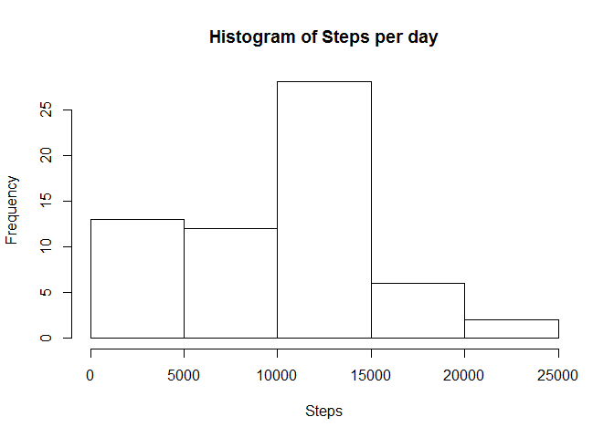
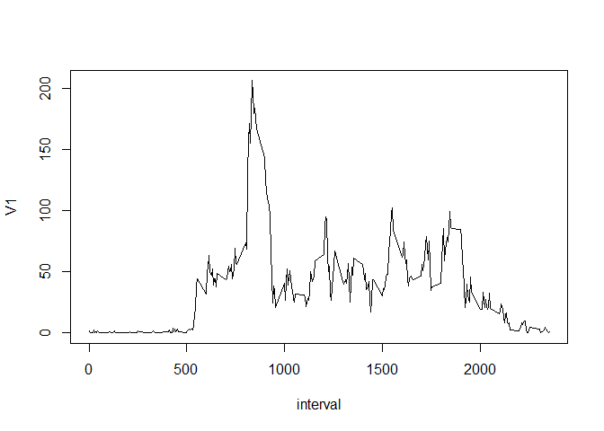
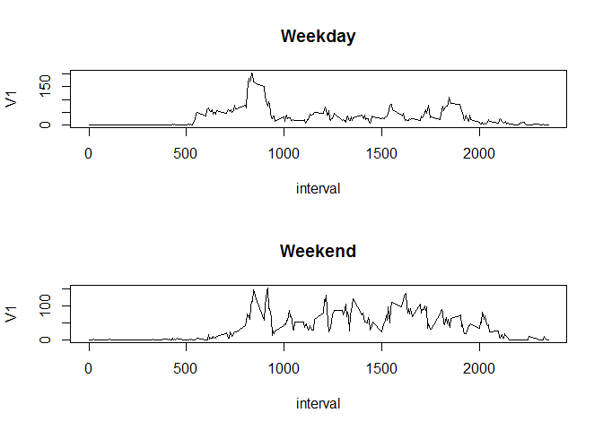

# Reproducible Research: Peer Assessment 1


## Loading and preprocessing the data

```r
setwd("C:\\Users\\cbbornstein\\Google Drive\\Coursera\\Data Science\\Reproducible Reearch\\Project1")

activity_data <- read.csv(unz("activity.zip", "activity.csv"))

library(data.table)

activity_data_table <- data.table(activity_data)
```


## What is mean total number of steps taken per day?


### Histogram of the total number of steps taken each day


```r
hist(
  aggregate(activity_data_table$steps, list(activity_data_table$date), FUN=sum,na.rm=TRUE )$x, 
  main="Histogram of Steps per day", 
  xlab = "Steps")
```

<!-- -->

###    What is mean number of steps taken per day?

```r
mean(aggregate(activity_data_table$steps, list(activity_data_table$date), FUN=sum,na.rm=TRUE )$x)
```

```
## [1] 9354.23
```
###    What is median number of steps taken per day?

```r
median(aggregate(activity_data_table$steps, list(activity_data_table$date), FUN=sum,na.rm=TRUE )$x)
```

```
## [1] 10395
```


## What is the average daily activity pattern?

### Make a time series plot (i.e. type = "l") of the 5-minute interval (x-axis) and the average number of steps taken, averaged across all days (y-axis)

```r
activity_data_table_1 <- na.omit(activity_data_table)
plot(activity_data_table_1[,mean(steps), by=interval], type="l")
```

<!-- -->

## Imputing missing values

### Devise a strategy for filling in all of the missing values in the dataset. The strategy does not need to be sophisticated. For example, you could use the mean/median for that day, or the mean for that 5-minute interval, etc.


<h3><span style="color:blue"><b>
To fill in missing values, I use the replace function to replace missing values with median number of all step measurements </b>
</span></h3>


### Create a new dataset that is equal to the original dataset but with the missing data filled in.

```r
activity_data_table[ , steps := replace(steps, is.na(steps), median(steps, na.rm=TRUE)) , by=.(interval)]
```
### Make a histogram of the total number of steps taken each day and Calculate and report the mean and median total number of steps taken per day. Do these values differ from the estimates from the first part of the assignment? What is the impact of imputing missing data on the estimates of the total daily number of steps?


```r
hist(
  aggregate(activity_data_table$steps, list(activity_data_table$date), FUN=sum )$x, 
  main="Histogram of Steps per day", 
  xlab = "Steps")
```

<!-- -->


###    What is mean number of steps taken per day?

```r
mean(aggregate(activity_data_table$steps, list(activity_data_table$date), FUN=sum,na.rm=TRUE )$x)
```

```
## [1] 9503.869
```
###    What is median number of steps taken per day?

```r
median(aggregate(activity_data_table$steps, list(activity_data_table$date), FUN=sum,na.rm=TRUE )$x)
```

```
## [1] 10395
```
<h3><span style="color:blue"><b>
The median number of steps remained the same but the mean increased </b>
</span></h3>


## Are there differences in activity patterns between weekdays and weekends?

### In order to make plots for weekdays vs. weekend we must first mark days as weekday or weekend. We do this by creating an array consisting of names of weekdays. Then we add a column to the data.table which indicates whether the particular date is a weekday or weekend day. 


```r
weekdays1 <- c('Monday', 'Tuesday', 'Wednesday', 'Thursday', 'Friday')
 activity_data_table$wkDay <- c('weekend', 'weekday')[(weekdays(as.Date(activity_data_table$date)) %in% weekdays1)+1L]
```


```r
par(mfrow=c(2,1))
plot(activity_data_table[wkDay=="weekday",mean(steps), by=interval], type="l", main="Weekday")
plot(activity_data_table[wkDay=="weekend",mean(steps), by=interval], type="l", main="Weekend")
```

<!-- -->

